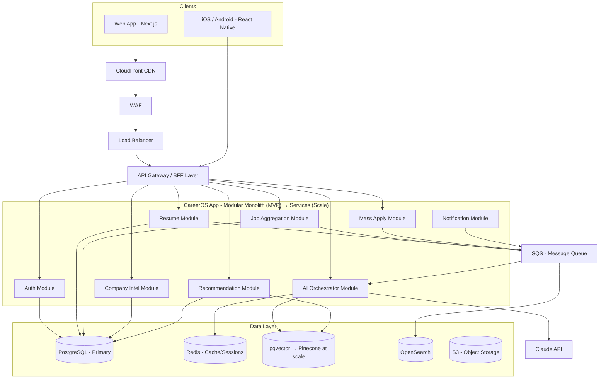
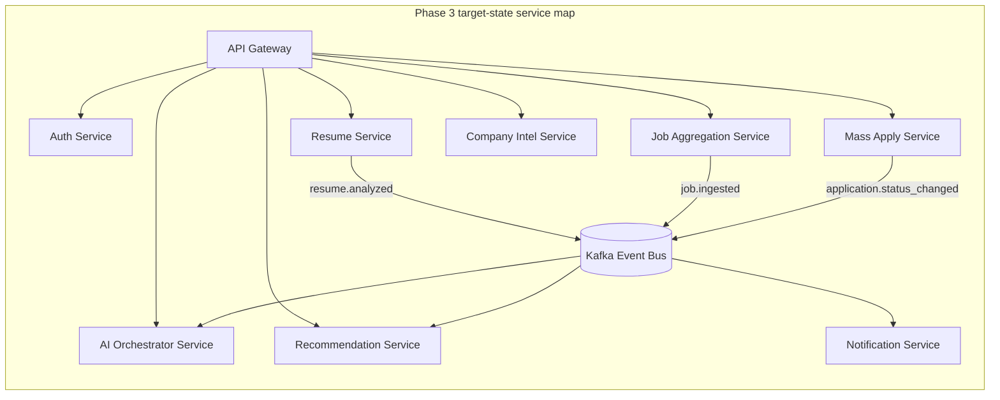
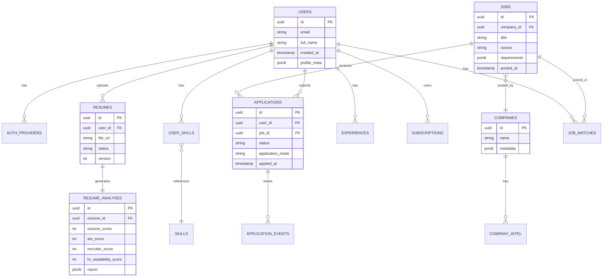
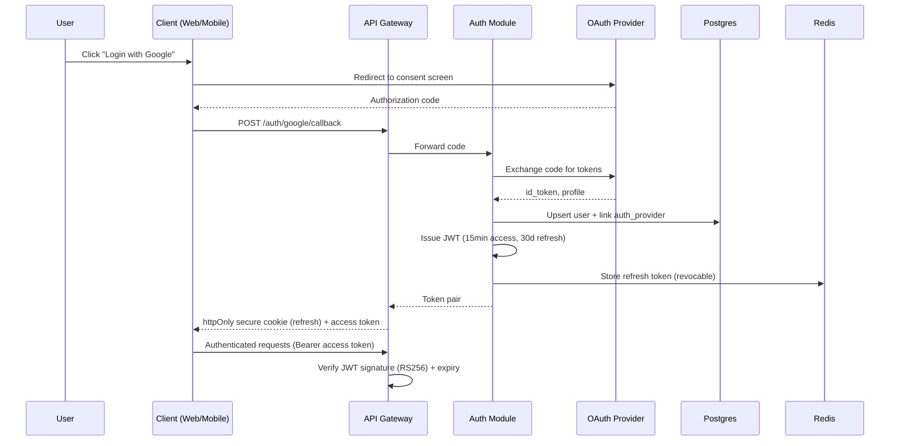
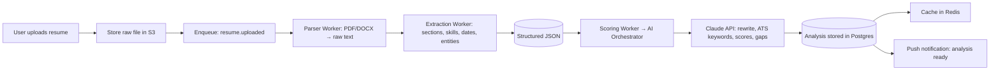
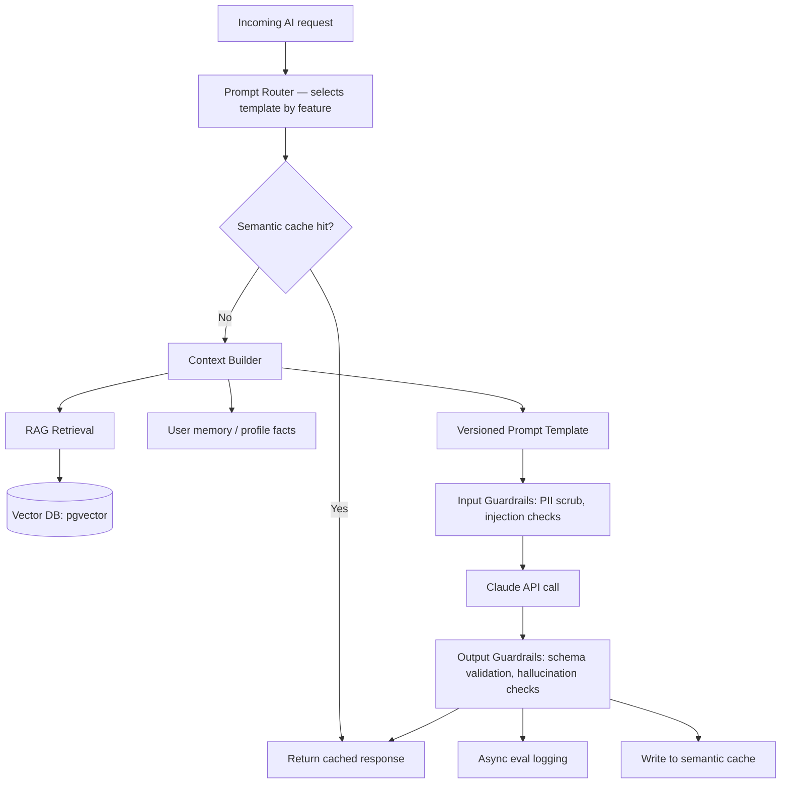
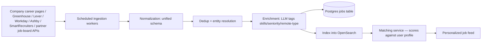
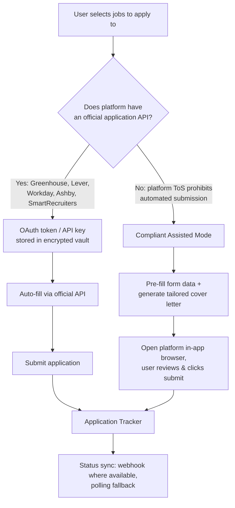
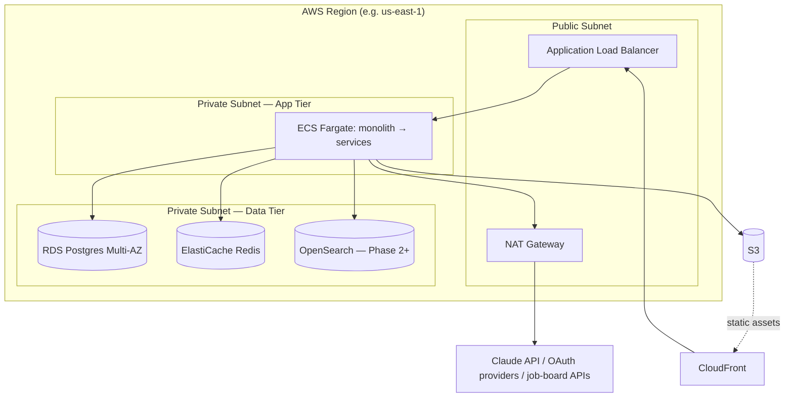
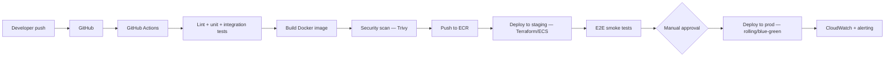

# CareerOS — Software Architecture Document (SAD)

**Version:** 1.0 (MVP-First Edition)
**Prepared for:** Solo founder, pre-seed/bootstrapped stage
**Cloud recommendation:** AWS (primary), cloud-agnostic where it matters
**Guiding philosophy:** Design the target-state architecture for 10M+ users, but *build* a lean, low-ops MVP that can grow into it without a rewrite.

---

## How to read this document

Every section below has two lenses:

- **🟢 MVP (Day 1)** — what you actually build as a solo founder, optimized for speed, low cost, and low operational burden.
- **🔵 Scale (Target State)** — the architecture this evolves into as you cross ~50K → 1M → 10M users.

The MVP is not a "toy" version — it's a **subset of the same architecture with fewer boxes turned on**. Nothing in Phase 1 needs to be thrown away in Phase 3; services get *extracted*, not *rewritten*. This is the single most important decision in this document: **start as a modular monolith, not 15 microservices**, because as a solo founder, distributed-systems overhead (network calls, service discovery, distributed tracing, eventual consistency bugs) will kill your velocity long before you have the traffic to need it.

---

## 1. Executive Summary

CareerOS is an AI-native career operating system: resume intelligence, career coaching, company intelligence, job discovery, and (compliant) mass-apply automation, unified around Claude as the reasoning engine.

**Core architectural bets:**

1. **Modular monolith → microservices, phased.** One deployable app with clean internal module boundaries (Auth, Resume, AI, Jobs, Apply, Company, Recommendations) that mirror your *future* service boundaries exactly. When a module needs independent scaling (almost always AI processing first), you extract it — the interface is already clean.
2. **Claude as the central reasoning layer**, not a bolted-on feature. A dedicated **AI Orchestration Layer** sits between every product feature and the Claude API, handling prompt versioning, RAG context assembly, caching, guardrails, and evaluation — so every feature (resume scoring, coaching, company Q&A) is built on the same reliable substrate instead of ad hoc API calls scattered through the codebase.
3. **Compliance-first automation.** "Mass Apply" is the highest legal/ToS risk feature in this spec. The design routes applications through **official ATS APIs (Greenhouse, Lever, Workday, Ashby, SmartRecruiters)** for true automation, and falls back to a **"pre-fill + human click"** assisted mode for platforms (LinkedIn, Indeed) whose Terms of Service prohibit automated submission. This is a legal necessity, not a nice-to-have — see Section 11.
4. **Postgres as the system of record everywhere**, with Redis, OpenSearch, and a vector store as *derived* stores that can be rebuilt from Postgres. This keeps your MVP data layer to a single database you actually have to operate.
5. **AWS as default cloud** — broadest managed-service coverage, best documentation/community for a solo builder, mature startup credit programs (AWS Activate), and no lock-in risk for the AI layer since the Claude API is called directly over HTTPS regardless of cloud provider.

**What you will NOT build on day 1:** Kubernetes, a service mesh, multi-region active-active, a dedicated data platform team, or 20 microservices. You *will* design your code and schema so all of that is a scaling exercise, not a rewrite.

---

## 2. High-Level Architecture Diagram



**🟢 MVP:** Everything inside the dotted "modular monolith" box is **one deployable service** (one Docker image, one ECS Fargate service) with internal module boundaries enforced by folder structure and internal interfaces — not network calls.

**🔵 Scale:** Each module becomes its own service with its own deployment, autoscaling policy, and (where needed) its own database. AI Orchestrator and Job Aggregation are almost always the first two to extract, since they have the most different scaling curves (bursty/CPU-GPU-adjacent vs. scheduled batch).

---

## 3. Microservice Architecture (Phased Decomposition)

| Phase | User Scale | Architecture | What changes |
|---|---|---|---|
| **Phase 1 — MVP** | 0–50K users | Modular monolith, 1 Postgres, ECS Fargate (2–4 tasks) | Everything ships together; fast iteration |
| **Phase 2 — Growth** | 50K–1M users | Extract **AI Orchestrator**, **Job Aggregation**, **Mass Apply** as separate services (each with own autoscaling). Add read replicas. | Modules become services communicating over REST + async events; monolith remains for Auth/Resume/Company/Rec |
| **Phase 3 — Scale** | 1M–10M+ users | Full microservices, event-driven (Kafka/Kinesis replaces SQS for high-throughput topics), CQRS for job search, per-service databases where justified, multi-region read paths | Dedicated platform/infra team assumed |



**Communication pattern rule of thumb:** synchronous REST/gRPC for anything the user is waiting on in real time (login, fetch resume score); asynchronous events/queues for anything that can complete in the background (parsing, scraping, applying, notifications). This rule holds at every phase — it's why extraction later is cheap.

---

## 4. Folder Structure (Monorepo)

```
careeros/
├── apps/
│   ├── web/                 # Next.js (React) — SSR marketing + app shell
│   ├── mobile/               # React Native (Expo) — iOS + Android
│   └── admin/                 # Internal admin dashboard
│
├── services/                  # Each becomes an independently deployable service later
│   ├── auth/
│   │   ├── src/{controllers,services,repositories,middleware}
│   │   └── Dockerfile
│   ├── resume/
│   ├── ai-orchestrator/
│   │   ├── src/{prompts,rag,guardrails,evals}
│   ├── jobs-aggregation/
│   ├── mass-apply/
│   ├── company-intel/
│   ├── recommendations/
│   └── notifications/
│
├── packages/                  # Shared code — the reason monolith→microservice is cheap
│   ├── db-schema/              # Drizzle/Prisma schema, migrations
│   ├── shared-types/            # TypeScript types shared FE/BE
│   ├── auth-client/
│   ├── ui-components/
│   └── config/
│
├── infra/
│   ├── terraform/               # IaC — VPC, RDS, ECS, S3, etc.
│   ├── docker-compose.yml         # Local dev — spins up Postgres, Redis, OpenSearch
│   └── k8s/                        # Empty until Phase 3
│
├── .github/workflows/               # CI/CD
└── docs/adr/                          # Architecture Decision Records
```

**🟢 MVP note:** `services/*` all get built into **one Docker image** with a single entrypoint router in the monolith build (`apps/api-monolith`) that imports each service's Express/Fastify router. The folder separation is what lets you flip a config flag later and deploy `services/ai-orchestrator` standalone with zero code restructuring.

---

## 5. Database Design



**Indexing strategy:** B-tree on all FKs; composite index on `(user_id, status)` for applications; GIN index on `jsonb` columns (`requirements`, `profile_meta`) for flexible querying without a schema migration every time you add a field; full-text index (`tsvector`) on job titles/descriptions as a cheap MVP search before OpenSearch is warranted.

**🟢 MVP:** Single RDS Postgres instance (Multi-AZ for durability, not for scale). `pgvector` extension handles embeddings — no separate vector database needed yet.

**🔵 Scale — Sharding strategy:** Shard by `user_id` hash once a single Postgres instance can't hold write throughput (roughly >5K writes/sec sustained, which for this product likely means several million active users). Jobs/Companies data is **read-heavy and global** — this gets a read-replica fan-out and eventually its own dedicated cluster before user data ever needs sharding, since job listings churn constantly and are queried by everyone.

**Caching strategy:** Redis for (a) session/JWT refresh-token storage, (b) hot resume-analysis results (avoid re-scoring on every dashboard load), (c) rate-limit counters. Cache invalidation on write via explicit key deletion, not TTL-only, for anything user-facing (score, not stale).

---

## 6. API Design

**Style:** REST for the primary API (predictable, cacheable, easy to document with OpenAPI); a thin **GraphQL BFF** layer *optionally* added in Phase 2 purely for mobile, to reduce over-fetching on slow connections — not required for MVP.

**Versioning:** URL-based (`/api/v1/...`) — simplest to reason about and cache at the CDN/gateway level.

| Endpoint | Method | Purpose |
|---|---|---|
| `/api/v1/auth/{provider}/callback` | POST | OAuth/OTP login, returns JWT pair |
| `/api/v1/resumes` | POST | Upload resume (multipart → S3 presigned URL) |
| `/api/v1/resumes/{id}/analysis` | GET | Retrieve score + AI report |
| `/api/v1/ai/coach` | POST | Streamed chat with AI Career Coach |
| `/api/v1/companies/{slug}` | GET | Company intelligence profile |
| `/api/v1/jobs?filters=...` | GET | Paginated, filterable job search |
| `/api/v1/applications` | POST | Trigger apply (auto or assisted mode) |
| `/api/v1/applications/{id}` | GET | Application status/timeline |
| `/api/v1/recommendations/roadmap` | GET | Personalized improvement roadmap |

All endpoints: JSON, `Authorization: Bearer <JWT>`, rate-limited per user tier, documented via OpenAPI 3.1 auto-generated from route decorators (e.g., `zod-to-openapi` if using Fastify/Express + Zod).

---

## 7. Authentication Flow

Supports Email OTP, Google, GitHub, LinkedIn, Apple, JWT, sessions, optional MFA (TOTP).



- **Email OTP:** 6-digit code, Redis-backed with 5-minute TTL, rate-limited to 5 attempts.
- **JWT:** RS256 (asymmetric — lets you rotate signing keys and let other services verify without sharing secrets). Short-lived access token (15 min), refresh token rotated on each use and stored server-side so it's revocable (pure stateless JWT can't be revoked — this hybrid gives you both statelessness for access checks and revocability for logout/security events).
- **MFA:** TOTP (Google Authenticator-compatible), optional per user, enforced for high-risk actions (e.g., connecting a job-portal account for Mass Apply).
- **Session management:** Refresh tokens in Redis keyed by `user_id:device_id`, enabling "log out all devices."

---

## 8. Resume Processing Pipeline



**Parsing:** `pdf-parse`/`pdfplumber`-equivalent for text layer PDFs, `mammoth` for DOCX, OCR fallback (Textract or Tesseract) for scanned/image-based resumes. Extraction combines deterministic regex/heuristics (dates, emails, section headers) with an LLM pass for anything unstructured (project descriptions, informally-formatted experience).

**Scoring:** Multiple scores (Resume/ATS/Recruiter/HR Readability/Industry Match) are generated via **structured Claude output** (JSON schema-constrained response) rather than free text, so scores are reliably parseable and consistent across runs — critical for a feature the whole dashboard depends on.

---

## 9. AI Processing Pipeline

This is the architectural heart of the product — every AI feature (resume scoring, coaching, company Q&A, roadmap generation) flows through the same orchestrator.



- **Prompt management:** Versioned templates in a config store (not hardcoded strings), so you can A/B test and roll back prompts without a deploy. Each template tagged with the model version it was validated against.
- **RAG pipeline:** Embeddings (via a dedicated embedding model, not Claude itself) stored in `pgvector` for MVP scale; migrate to a managed vector DB (e.g., Pinecone) only once query latency or index size at Phase 2/3 scale demands it. RAG feeds company data, resume history, and past coaching context into prompts.
- **Hallucination prevention:** Structured outputs (JSON schema) wherever the result feeds a UI element (scores, extracted fields); citations required for factual company-data claims traced back to source documents; a **confidence/uncertainty field** in every structured response so the UI can flag "low confidence" outputs for review rather than presenting everything with equal authority.
- **Guardrails:** Input-side PII redaction before logging, prompt-injection pattern checks on any user-supplied text going into a prompt (especially resume text, which is untrusted input); output-side schema validation with a retry-with-correction loop if the model returns malformed JSON.
- **Evaluation pipeline:** Golden-set regression tests (a fixed set of resumes/questions with expected score ranges) run against every prompt-template change before it ships, plus ongoing sampling of production outputs for human review.
- **Caching:** Semantic caching (embed the query, check similarity against recent queries) rather than exact-match caching — huge cost saver for a feature like the AI Career Coach where users phrase the same question many ways.

---

## 10. Job Aggregation Pipeline



**Sourcing legality note:** Prioritize sources with **official public APIs or explicit partner agreements** (Greenhouse Job Board API, Lever Postings API, Workday's public job feeds, Ashby, SmartRecruiters — all designed to be publicly consumed). For platforms like LinkedIn/Indeed that restrict scraping in their Terms of Service, do **not** scrape directly; use their official partner/affiliate APIs where available, or simply deep-link out to the listing. This avoids the single most common legal landmine in this category of product.

**Dedup:** Fuzzy match on (normalized company name + normalized title + location) since the same role is often posted on multiple boards.

---

## 11. Mass Apply Pipeline (with Compliance Considerations)

This is the feature that needs the most care — most job platforms' Terms of Service explicitly prohibit automated form submission with stored credentials. The architecture routes around this instead of ignoring it.



- **Credential storage:** Never store raw platform passwords. Use OAuth where the platform supports it; where it doesn't, this pipeline **should not exist** in automated form — assisted mode only.
- **Encryption:** Any stored tokens encrypted at rest via envelope encryption (KMS-managed data key per user), decrypted only inside the Mass Apply service's isolated execution context.
- **Assisted mode is not a lesser feature** — it still delivers the core value (tailored resume + cover letter pre-filled, one click away) without violating a platform's terms, which protects both the user's account and your company from legal exposure.
- **Audit log:** Every application action logged immutably (who, what, when, which mode) — essential if a platform ever disputes automated activity on a user's account.

---

## 12. Company Intelligence Pipeline

**Data sources (all public):** official careers pages, public SEC/annual filings for hiring trends, public Glassdoor/levels.fyi-style salary ranges (aggregated, not scraped verbatim), company blog posts/engineering blogs, public job postings (feeds Section 10) for required-skills trends over time.

**Pipeline shape:** scheduled crawler → content extraction → chunking → embedding → stored in the same `pgvector` store used by the AI Orchestrator, tagged by `company_id`. When a user asks "what's Google's interview process like?", the AI Orchestrator's RAG step retrieves the relevant chunks and Claude synthesizes an answer **grounded in retrieved content with citations**, rather than relying on the model's parametric knowledge — critical because hiring processes and role openings change constantly.

**Refresh cadence:** Job openings — daily. Interview process/culture content — weekly. Salary bands — monthly (these change slowly and benefit from aggregation across many data points rather than frequent re-scraping).

---

## 13. Recommendation Engine

Three signal layers, blended:

1. **Content-based filtering** — match user's structured profile (skills, experience level, target roles) against job/company requirements using vector similarity.
2. **Collaborative signals** — "users with a similar profile to yours also pursued X certification / applied successfully to Y company tier" — requires a meaningful user base, so this layer's weight starts at zero and increases as data accumulates (cold-start handled gracefully by content-based-only in Phase 1).
3. **LLM re-ranking** — Claude re-ranks the top-N candidates from the above with reasoning ("why this recommendation, specifically, for this user"), which is what turns a recommendation list into the "roadmap with explanations" the product spec asks for.

**Output:** a versioned "roadmap" object (certifications, projects, skill gaps, target companies) stored per user, regenerated on meaningful profile changes (new resume upload, new skill added) rather than on every page load.

---

## 14. Scalability Strategy

| Concern | 🟢 MVP (0–50K users) | 🔵 Growth (50K–1M) | 🔵 Scale (1M–10M+) |
|---|---|---|---|
| Compute | ECS Fargate, 2–4 tasks, autoscale on CPU | ECS Fargate per extracted service, autoscale on queue depth for async workers | EKS, cluster-autoscaler, spot instances for batch/scraping workloads |
| Database | Single RDS Postgres (Multi-AZ) | + read replicas for job search & company data | Sharded by user_id; jobs/companies on dedicated read-optimized cluster |
| Caching | Single Redis instance | Redis cluster mode | Multi-layer cache (CDN edge + Redis + in-process) |
| Search | Postgres full-text | OpenSearch cluster (3 nodes) | OpenSearch with dedicated master nodes, index-per-region |
| Queue | SQS (standard) | SQS + SNS fan-out | Kafka/Kinesis for high-throughput event streams |
| AI layer | Direct Claude API calls, simple cache | Dedicated AI Orchestrator service, semantic cache, request batching | Multi-region orchestrator, prompt-level load shedding, tiered model routing by task complexity |
| CDN | CloudFront, single distribution | + regional edge caching | Multi-CDN or additional PoPs by user geography |

**Key principle:** scale the **data layer** before you scale **compute** — most early "we need Kubernetes" instincts are actually "we need a read replica and a cache invalidation strategy."

---

## 15. Security Architecture

- **AuthN/AuthZ:** OAuth 2.0 / OIDC for social logins, RS256 JWT, **RBAC** with roles (`user`, `admin`, `support`) enforced at the API gateway layer via middleware, not scattered per-endpoint checks.
- **Encryption:** TLS 1.3 in transit everywhere; AES-256 at rest for RDS/S3 (KMS-managed keys); field-level encryption for any stored third-party job-portal tokens (Section 11).
- **Secrets management:** AWS Secrets Manager (or HashiCorp Vault at scale) — no secrets in environment files or repo, ever; rotated on a schedule.
- **OWASP protection:** input validation/sanitization (Zod schemas on every endpoint), parameterized queries only (ORM-enforced), rate limiting per-IP and per-user, CSRF tokens on state-changing web requests, Content-Security-Policy headers, dependency scanning (Snyk/Dependabot) in CI.
- **API security:** WAF in front of the ALB (managed rule sets for common exploits + custom rules for scraping/credential-stuffing patterns), per-endpoint rate limits tiered by subscription plan.
- **Compliance posture:**
  - **GDPR:** data export/delete endpoints from day 1 (cheap to build early, expensive to retrofit), explicit consent for AI processing of resume data, EU data residency plan documented even if not implemented until an EU user base justifies it.
  - **SOC 2:** not pursued at MVP stage (cost/time not justified pre-revenue), but architecture is built SOC-2-ready — audit logging, access controls, encrypted secrets, documented incident response — so a Type II audit is a paperwork exercise later, not a re-architecture.
- **Cloud security:** least-privilege IAM roles per service (no shared "god" credentials), VPC private subnets for all data stores (no public database endpoints, ever), security groups scoped tightly per service.

---

## 16. Infrastructure Architecture



**🟢 MVP infra footprint (deliberately minimal):** 1 VPC, 2 AZs (for RDS Multi-AZ, not for full HA compute), ECS Fargate (no EC2 to patch), RDS Postgres `db.t4g.medium`, ElastiCache `cache.t4g.micro`, S3 + CloudFront, all provisioned via Terraform so it's reproducible and the eventual Phase 2 expansion is additive, not a rebuild.

---

## 17. DevOps Pipeline



- **IaC:** Terraform for all infra (VPC, RDS, ECS, S3, IAM) — one `terraform apply` reproduces the whole environment; essential for disaster recovery.
- **Environments:** `dev` (local docker-compose), `staging` (real AWS, smaller instance sizes), `prod`.
- **Observability stack:** CloudWatch Logs (structured JSON logging) + CloudWatch Alarms for MVP; graduate to Datadog or Grafana/Prometheus/Loki once log volume/cost justifies it. Distributed tracing (OpenTelemetry) added at the point services are extracted (Phase 2) — tracing a monolith is far less critical than tracing cross-service calls.
- **Disaster recovery:** RDS automated snapshots (daily, 7-day retention MVP → 30-day + cross-region copy at scale), S3 versioning enabled from day 1, Terraform state in a versioned/locked S3 backend so infra itself is recoverable.

---

## 18. Cost Estimation

Rough monthly AWS-centric estimates (US region, on-demand pricing, excludes Claude API usage which is billed separately by Anthropic based on token volume and scales with feature usage, not user count directly):

| Users | Compute (ECS) | Database (RDS) | Cache (Redis) | Storage (S3) | Search (OpenSearch) | CDN | **Est. Infra Total/mo** |
|---|---|---|---|---|---|---|---|
| **1,000** | $30–60 (1–2 small tasks) | $50 (t4g.medium) | $15 (t4g.micro) | $5 | — (Postgres FTS) | $10 | **~$110–140** |
| **100,000** | $400–800 (autoscaled tasks) | $300–500 (r6g.large + 1 replica) | $100 (cluster mode, small) | $50 | $200 (3-node cluster) | $150 | **~$1,200–1,800** |
| **1,000,000** | $3,000–6,000 (multi-service, autoscaled) | $2,500–4,000 (sharded/replicas) | $600 | $400 | $1,200 (dedicated masters) | $800 | **~$8,500–13,000** |

**Not included above, budget separately:** Claude API usage (scales with AI-feature engagement — resume analyses, coaching messages, roadmap generations; track cost-per-active-user as a core metric from day 1), third-party data/embedding APIs, email/SMS provider costs, monitoring tooling once beyond free tier (Datadog etc.), and engineering time (the real cost driver at every stage).

---

## 19. Technology Stack (with reasons)

| Layer | Recommendation | Why |
|---|---|---|
| **Web frontend** | Next.js (React) | SSR for SEO on company/job pages, huge ecosystem, one team can own web + API routes early |
| **Mobile** | React Native (Expo) | Single codebase for iOS + Android — critical for a solo founder; native modules available when needed |
| **Backend framework** | Node.js (Fastify or NestJS) + TypeScript | Shared types with frontend (packages/shared-types), huge library ecosystem, fast enough for I/O-bound workloads (this app is mostly orchestration, not CPU-bound) |
| **Primary database** | PostgreSQL (AWS RDS) | Relational integrity for user/application/job data, `pgvector` extension removes the need for a separate vector DB at MVP scale, mature tooling |
| **Cache** | Redis (ElastiCache) | Sessions, semantic cache, rate limiting — one tool, three jobs |
| **Vector DB** | pgvector (MVP) → Pinecone or Weaviate (scale) | Avoid operating a second database until embedding volume/query latency actually demands a specialized store |
| **Search engine** | Postgres full-text (MVP) → OpenSearch (scale) | Don't stand up a search cluster before you have enough jobs/companies to make Postgres FTS insufficient |
| **AI** | Claude API (Anthropic) as primary LLM | Strong structured-output reliability and long-context handling, well-suited to resume/document-heavy reasoning tasks |
| **Message queue** | Amazon SQS (MVP) → + Kafka/Kinesis (scale) | SQS requires zero operational overhead; Kafka only earns its complexity at high sustained event throughput |
| **Object storage** | Amazon S3 | Industry standard, cheap, integrates natively with CloudFront and Textract (OCR fallback) |
| **Auth** | Custom (Auth.js/Passport) + OAuth providers directly, not a third-party auth SaaS | Given the breadth of required providers (Google/GitHub/LinkedIn/Apple/Email OTP) and JWT/session requirements, owning this avoids per-MAU pricing from auth SaaS vendors once you scale |
| **Hosting/Cloud** | AWS (ECS Fargate) | Broadest managed-service catalog, best documentation depth, startup credit programs, no lock-in for the AI layer |
| **Monitoring** | CloudWatch (MVP) → Datadog/Grafana (scale) | Start with what's bundled; graduate when log/metric volume justifies dedicated tooling |
| **Logging** | Structured JSON → CloudWatch Logs → (later) OpenSearch/Loki | Structured from day 1 so the migration to a log platform later is just a sink change |
| **Analytics** | PostHog or Mixpanel (product analytics) + a lightweight internal events table | Understand feature engagement (which AI features drive retention) without building analytics infra yourself |
| **Payments** | Stripe | De facto standard, handles subscriptions/metered billing (relevant if Claude usage costs need to map to a usage-based tier) |
| **Notifications (push)** | Firebase Cloud Messaging (mobile) + web push | Free, standard, works across iOS/Android/web |
| **Email** | Resend or AWS SES | SES is cheapest at scale and integrates natively with the AWS stack; Resend is a nicer DX for MVP if budget allows |
| **CI/CD** | GitHub Actions | Free tier generous enough for solo/small-team use, integrates directly with the monorepo |
| **IaC** | Terraform | Cloud-agnostic-ish, huge community modules for AWS primitives, reproducible environments |

---

## 20. Future Features

- **Salary negotiation simulator** — AI role-plays a hiring manager negotiation based on the specific offer and company data.
- **Alumni/referral graph** — surface warm-intro paths using LinkedIn-connected, publicly-visible connections at target companies.
- **Voice-based mock interviews** — real-time voice AI interviewer with post-interview feedback transcript and scoring.
- **Team/university edition** — bulk seats for university career centers or bootcamps, with cohort-level analytics for career-services staff.
- **Employer-side product** — flip the data asset (aggregated, anonymized skill-gap and market data) into a B2B recruiting-insights product once the user-side dataset is large enough to be valuable.
- **Browser extension** — one-click "save job" and pre-fill assist directly inside LinkedIn/Indeed's own UI (assisted mode, same compliance posture as Section 11).
- **Multi-language resume support** — expand ATS/scoring logic beyond English-language markets.

---

### Closing note

The single highest-leverage decision in this document is the **modular monolith with clean module boundaries**. It's the difference between a solo founder shipping features weekly for the first year, versus debugging distributed systems instead of talking to users. Everything else — the phased database strategy, the compliance-first Mass Apply design, the AI Orchestrator as a first-class layer — exists to make sure that when growth *does* demand more architecture, you're extracting along seams you already drew, not re-architecting under pressure.
